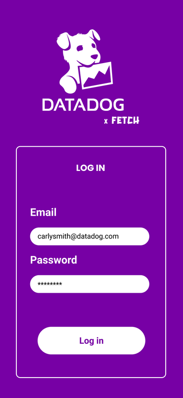
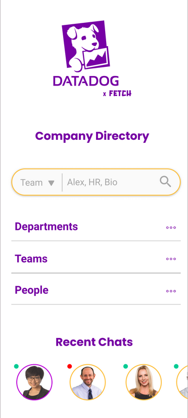
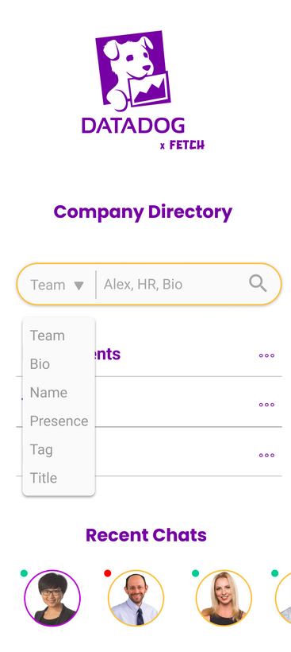
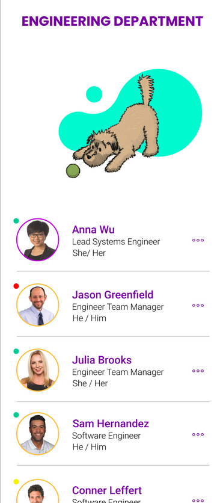
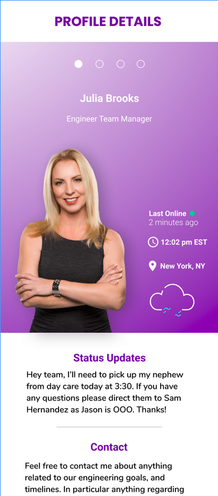
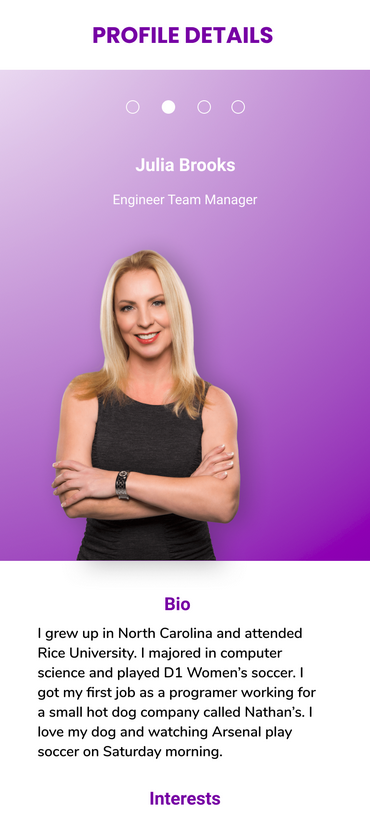
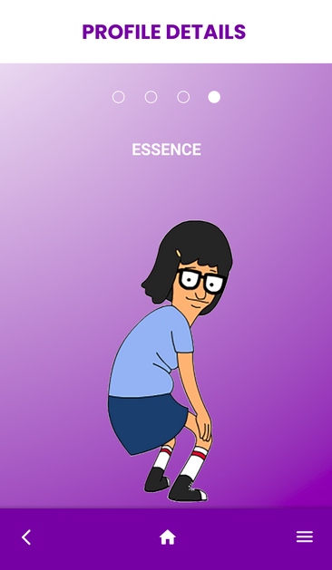
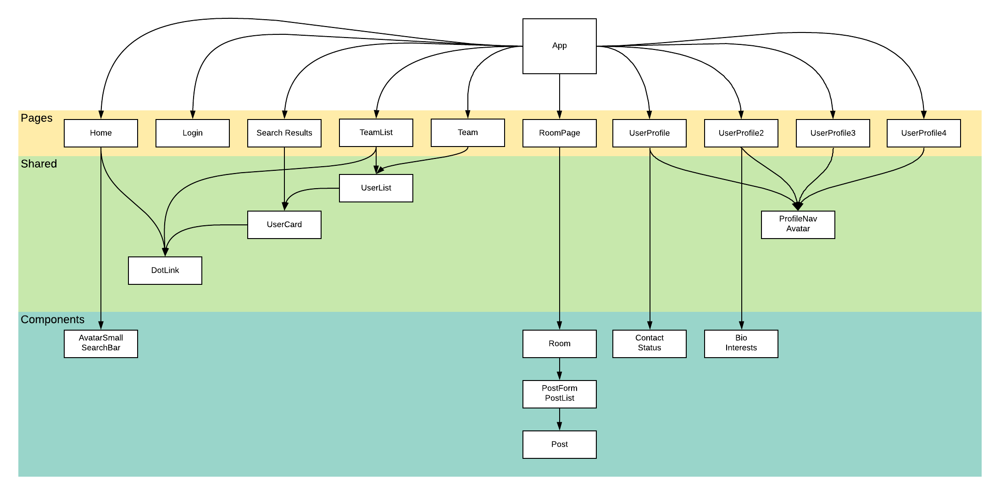
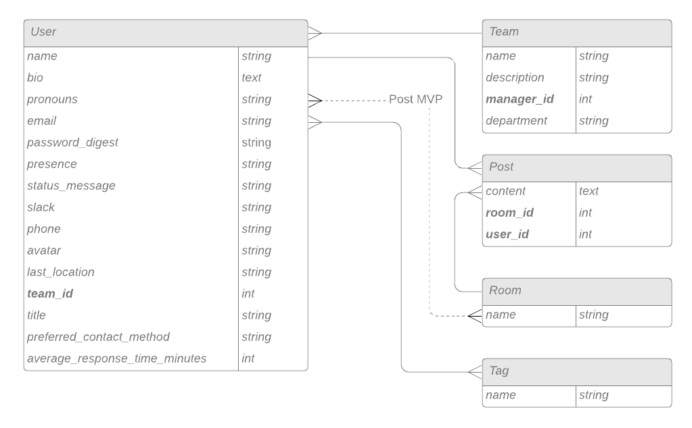
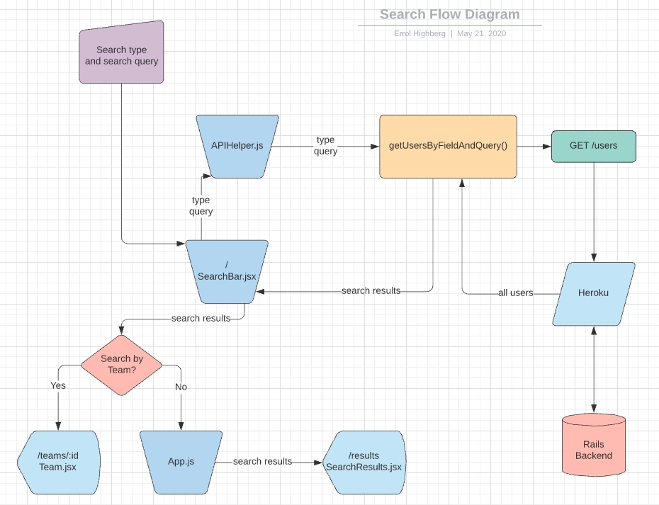

# Fetch

  - [Overview](#Overview)
  - [Team](#Team)
  - [Problem Statement](#Problem-Statement)
  - [MVP](#MVP)
    - [MVP Client (Front End)](#MVP-Client-Front-End)
      - [Wireframes](#Wireframes)
      - [Component Hierarchy](#Component-Hierarchy)
      - [Component Breakdown](#Component-Breakdown)
    - [MVP Server (Back End)](#MVP-Server-Back-End)
      - [ERD Model](#ERD-Model)
      - [Data Flow](#Data-Flow)
  - [Post-MVP](#Post-MVP)
  - [Code Issues & Resolutions](#Code-Issues--Resolutions)

 

## Overview

**Fetch** is a workplace communication and informational tool. It
incorporates real-time chat with ActionCable connection to a Ruby on Rails
server, as well as a directory service organizing employees by their team,
expertise, etc.
 

## Team

- David Coughlin - User Experience Designer (UX Research & Design)
- Errol Highberg - Software Developer (Application Logic & Documentation)
- Tara Solbrig - Software Developer (Frontend Developer & Animations/Micro-interactions)
- Trevor Smith-Holbourn - Software Developer (Realtime Chat & Server)
- Valeria Gonzalez - User Experience Designer (UX Research & Design)
 

## Problem Statement
Users need to work cross-functionally to do their job more effectively. But it can be difficult to obtain information from other teams.

How might we help users connect with the “the right” people outside their immediate team to make their workflow more efficient?
 

## MVP

One core feature is an employee directory system which users can search by
employee name, team, or self-defined tags (skills, hobbies, etc.). These
searches can be used to start chats directly (with an entire team, for
example), as well as look up contact information for specific people.

### MVP Libraries and external APIs

|     Library      | Description                                |
| :--------------: | :----------------------------------------- |
| React            | _Front end framework for reusable components._ |
|   React Router   | _In-app routing to make single page application._ |
|     Axios        | _Simpler interface for getting data to/from front end._ |
|      Formik      | _Simpler form handling in React by reducing boilerplate._ |
|    Faker         | _Generate seed data for fast development._          |
| Ruby on Rails    | _Backend server with easy database and routing setup._ |
| CORS             | _Allow Cross Origin Resource Sharing in development._ |
| Tailwind CSS     | _Reduce boilerplate CSS for fast development._ |
| ActionCable.js   | _Real-time updates interfacing with Rails backend._ |
| React-Swipeable  | _Add swipe gestures for improved mobile experience._ |
| React-Interactions | _Component library for designing micro-interactions._ |
| Redis            | _Production database for handling web sockets._ |

 

### MVP Client (Front End)

#### Wireframes

#### Component Hierarchy

#### Component Breakdown

| Page | Description                                                    |
| :----------: | :----------------------------------------------------: |
| FourNaughtFour | 404 error handling. |
| Home | Login, search, and directory access. |
| Login | User login, and landing page if not logged in. |
| RoomListPage | List all chat rooms. |
| RoomPage | Handles display and creation of posts in a chat room.|
| SearchResults | Display results of search. |
| Team | Display members of a team. |
| TeamList | Display all teams and their team leaders. |
| UserProfile | Display status updates and contact info for a single user. |
| UserProfilePage2 | Display bio, interests, and social activity for a single user. |
| UserProfilePage3 | Display pictures for a single user. |
| UserProfilePage4 | Display Essence for a single user. |

| Component | Description                                               |
| :----------: | :----------------------------------------------------: |
| Avatar | Display picture, name, and title of user. |
| AvatarSmall | Smaller picture, name, and title of user. |
| Bio | Display user bio information. |
| Contact | Display contact info, including preferred method and average response time. |
| DotLink | Display the three dots used in links. |
| Interests | Display user interests. |
| Nav | Site navigation. |
| Pics | Display user's pictures. |
| Post | Display a single post in a room, including user name and picture. |
| PostForm | Submit posts to rooms. |
| Presence | Online / away / offline status of user. |
| ProfileNav | Click and swipe navigation through user profile. |
| Room | Displays posts in a chat room, with their author and time. |
| RoomCard | Summary info for a room. |
| RoomList | List all chat rooms. |
| SearchBar | Query by search type and string input. |
| Status | Incorporates presence and away message. |
| UserCard | Summary information for a single user. |
| UserList | Display a collection of UserCards. |

 

### MVP Server (Back End)

#### ERD Model

#### Endpoints

- GET `/users`
	- Index route returning all users
- GET `/users/:id`
  - Show route returning a single user requested by ID

 

- GET `/rooms`
  - Index route returning a list of all chat rooms
- GET `/roomwithdetails/:id`
  - Show route for a single chat room with all its posts and user info

 

- POST `/posts`
  - Create route which adds a post to a room

 

- GET `/teams`
  - Index route returning all teams

 

- Web Socket @ `wss://mysterious-anchorage-39512.herokuapp.com/cable`
  - Live updates for realtime chat

 

### Data Flow

***

## Post-MVP

- Send email from app
- Share documents and / or media
- More micro-interactions
- Chat rooms are only visible to participants
- Users can sticker good posts
- Add department summary page
- Animated dropdown from team list, displaying members of that team
- Tooltips for contact methods on user profiles
- User profile "schedule a meeting" button redirecting to Calendly

 

***

## Code Issues & Resolutions

### Expected Issues

- Making sockets work for real time chat rooms.
- Displaying profile information effectively to users.
- Time management on short deadline.
- Dynamic generation and access to chat rooms.

### Encountered Issues

- Seeding self-referencing tables. Fixed by aliasing one of the table references.
- Development at the same time as design is very tough. Mitigated with about 3 meetings per day.
- Original design called for single search bar to search all fields. Added drop down search bar to allow selection of search type.
- Setting up ActionCable for deployment was very tricky, requiring some additional gems and NPM packages, as well as setting up the Redis server on Heroku.

***
